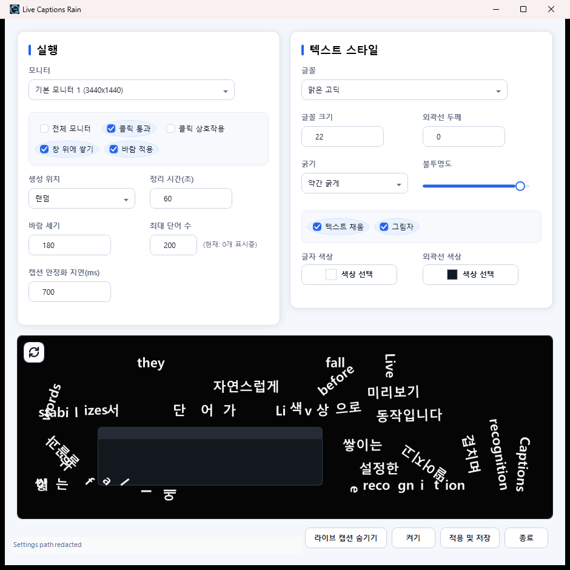

[English](README.md) | [한국어](docs/readme/README.ko.md)

# Live Captions Rain

Live Captions Rain is a Windows WPF app that turns Windows Live Captions into a physics-based word overlay. Caption words fall over the selected monitor, pile up on the screen floor, and can optionally stack on visible desktop window tops.

## Screenshots

### Settings



## Features

- Reads words from Windows Live Captions.
- Drops caption words into a transparent desktop overlay.
- Supports selected-monitor mode and all-monitor mode.
- Keeps the overlay click-through by default, with optional click interaction.
- Uses Box2D physics for gravity, stacking, wind, and window-top platforms.
- Detects visible desktop windows and uses only visible top edges for stacking.
- Splits words after high fall impacts.
- Supports Hangul-aware word fragmentation.
- Provides font family, size, weight, fill, outline, color, opacity, and shadow controls.
- Provides random, left-to-right, right-to-left, and center-biased spawn modes.
- Applies natural random wind with horizontal movement and light upward lift.
- Minimizes to tray on close.
- Supports Korean and English UI based on Windows display language.

## Requirements

- Windows 11
- Windows Live Captions
- .NET 8 SDK for development builds

## Quick Start

1. Enable Windows Live Captions, or let Live Captions Rain launch it.
2. Launch `LiveCaptionsRain.exe`.
3. Select the target monitor.
4. Adjust text style and physics options.
5. Press **Turn On**.
6. Close the settings window to keep the app running in the tray.

Settings are stored at:

```text
%APPDATA%\LiveCaptionsRain\settings.json
```

## Build

```powershell
dotnet restore
dotnet build LiveCaptionsRain.sln
dotnet test LiveCaptionsRain.sln
dotnet publish src\LiveCaptionsRain\LiveCaptionsRain.csproj -c Release -r win-x64 --self-contained false /p:PublishSingleFile=true /p:IncludeNativeLibrariesForSelfExtract=true
```

Generated `artifacts`, `bin`, and `obj` outputs should not be committed.

## Repository Layout

- `src\LiveCaptionsRain` - WPF app, settings window, tray integration, overlay, Live Captions adapter, Win32 interop, and rendering controls.
- `src\LiveCaptionsRain.Core` - caption processing, settings, localization, physics helpers, wind, window-platform resolution, and word fracture logic.
- `tests\LiveCaptionsRain.Tests` - unit tests for captions, settings, localization, physics, window filtering, wind, spawning, and text fracture.
- `docs` - project documentation and screenshots.
- `artifacts` - local generated builds and verification screenshots. This directory is ignored by git.

## Privacy

Live Captions Rain does not record audio and does not send caption text to a remote service. The app reads the text already displayed by Windows Live Captions. Settings are stored locally under `%APPDATA%\LiveCaptionsRain`.

## Known Limitations

- Windows Live Captions UI changes can require adapter updates.
- Text collision uses rectangular physics bodies for stability.
- Some shell, game, protected, or GPU-overlay windows may not expose usable geometry.
- Fullscreen or top-edge-attached windows are treated as occluders, not word platforms.
- Windows 11 is the supported target.

## Credits

- [SakiRinn/LiveCaptions-Translator](https://github.com/SakiRinn/LiveCaptions-Translator)
- [Me-in-U/LiveDialogue-Translator](https://github.com/Me-in-U/LiveDialogue-Translator)
- [Box2D.NET](https://www.nuget.org/packages/Box2D.NET)
- [Interop.UIAutomationClient](https://www.nuget.org/packages/Interop.UIAutomationClient)
- [WPF-UI](https://www.nuget.org/packages/WPF-UI)

## License

Apache-2.0. See [LICENSE](LICENSE).
